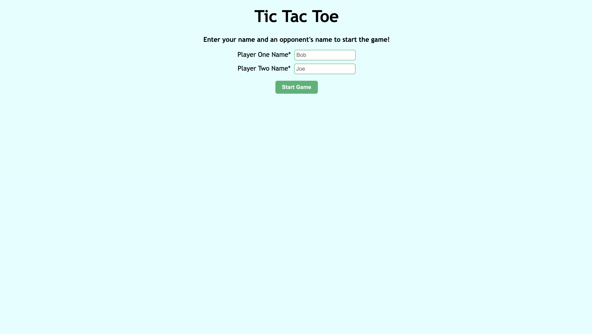
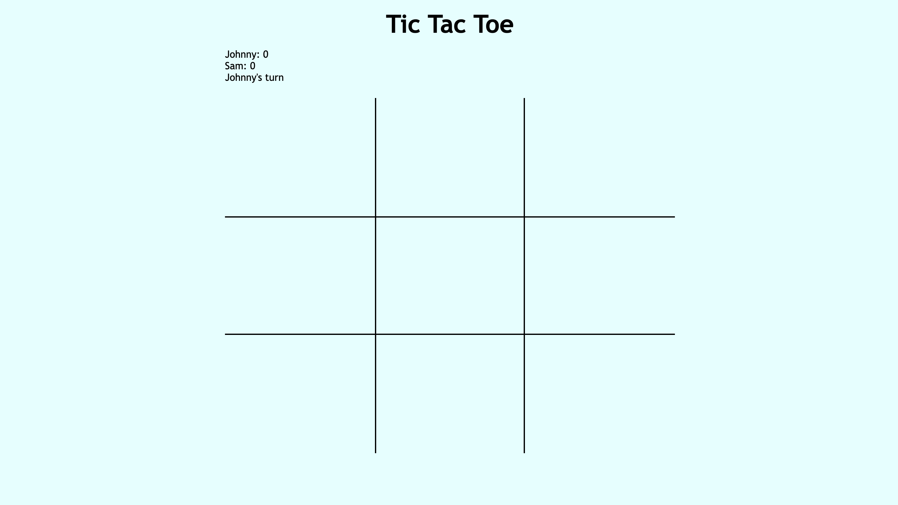
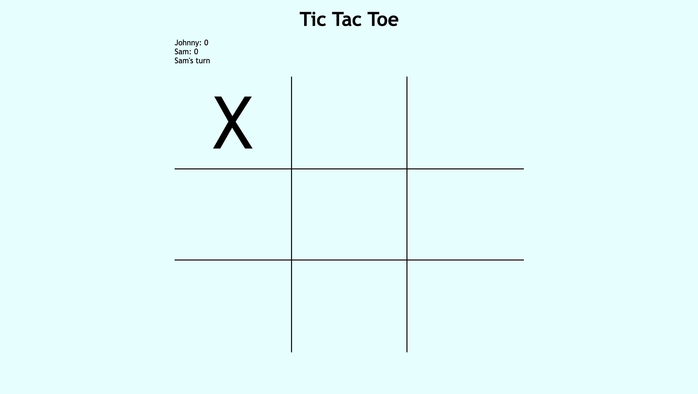
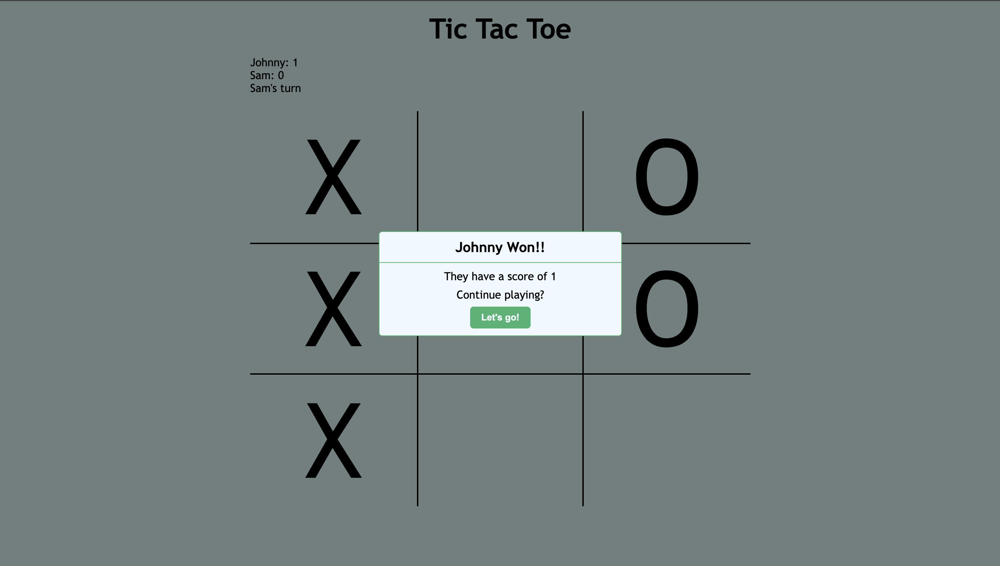
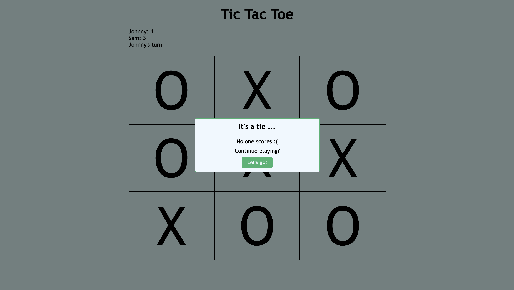
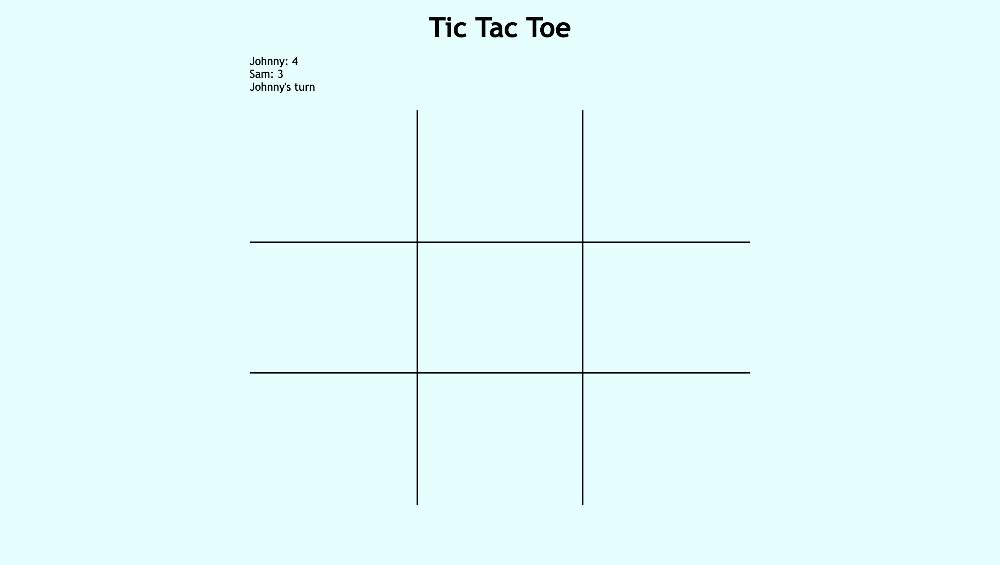

# Tic Tac Toe in JavaScript

Tic Tac Toe game project for the JavaScript course of TOP.

Link to project spec: https://www.theodinproject.com/lessons/node-path-javascript-tic-tac-toe

## Showcase

